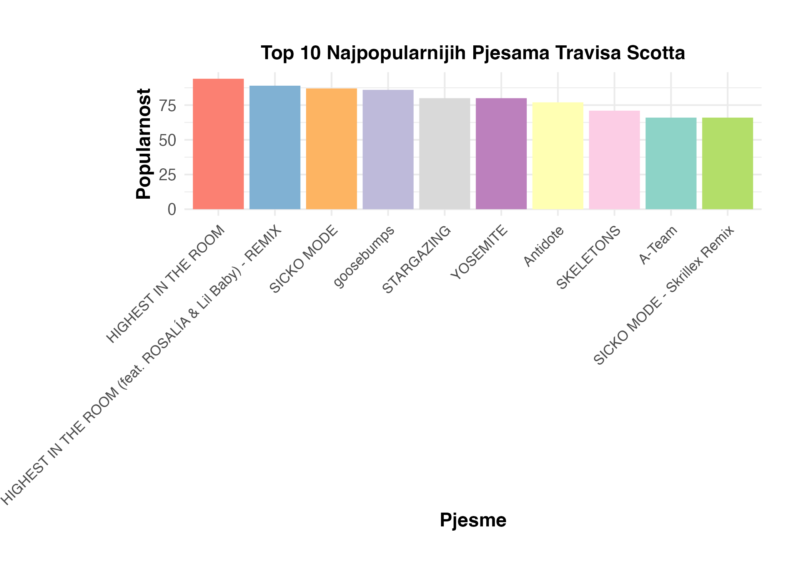

```{r setup, include=FALSE}
library(dplyr)
library(readr)
library(stringr)
library(hflights)
library(tidyr)
library(lubridate)
library(ggplot2)
knitr::opts_chunk$set(echo = TRUE)
```

## UVOD
Ovaj skup podataka pruža opsežnu zbirku pjesama s nizom atributa, uključujući, ali ne ograničavajući se na, popularnost pjesme, žanr, pojedinosti o izvođaču i niz akustičnih značajki poput tempa, energije itd. Ovi atributi omogućuju višestruku analizu, od razumijevanja preferencija slušatelja do istraživanja glazbenih trendova tijekom vremena.

Naš projekt ima za cilj istražiti ovaj skup podataka kako bismo otkrili uvide i obrasce u svijetu glazbe na Spotifyju. Za analizu različitih aspekata podataka koristit ćemo niz statističkih tehnika i metoda vizualizacije podataka. Projekt je strukturiran za istraživanje skupa podataka na sveobuhvatan način, počevši od početnog prikupljanja podataka i predobrade, prelazeći kroz istraživačku analizu podataka.

Krajnji cilj ovog projekta je napraviti analizu podatkovnog skupa, koji će biti zanimljiv svim čitateljima a ne samo ljubiteljima glazbe.


## OPĆENITO O PODATKOVNOM SKUPU
Paket spotifyr pruža podatke u sirovom, nefiltriranom obliku, dajući slobodu i fleksibilnost u oblikovanju analize. Ova neobrađenost znači da će početni koraci uključivati zadatke pretprocesiranja kao što su čišćenje nepotrebnih vrijednosti, rukovanje duplikatima i strukturiranje podataka na način koji najbolje odgovara analitičkim ciljevima.

Neki od zanimljivih atributa podatkovnog skupa kojeg ćemo eksplicitno prikazivati u našoj obradi su: 

 - Izvođač (Artist)
 - Godina izdanja (Release Year)
 - Žanr (Genre)
 - Popularnost pjesme (Track Popularity)
 - Dužina trajanja (Duration)
 
 
## UČITAVANJE PODATAKA I PROCESIRANJE
**Učitvanje podataka i odbacivanje nepotrebnih stupaca koji se neće koristiti u daljnjoj analizi**

Budući da smo odlučili provoditi analizu podataka za koju nam je potrebno samo određeni skup stupaca, odbacujemo nekorištene stupce tj. višak informacija.
```{r, include=FALSE}
source("../R/initial_formating.R", local = knitr::knit_global())
```
Na početku, podaci se učitavaju iz CSV datoteke. Ovaj korak je izveden korištenjem funkcije read_csv unutar R-a, a zanimljivo je da je prilikom učitavanja onemogućena automatska detekcija tipova stupaca. Ovo omogućuje veću kontrolu nad obradom podataka u kasnijim fazama, ali i veću odgovornost samog programera.

Nakon učitavanja, uslijedila je selekcija određenih stupaca iz skupa podataka. Ova operacija je ključna jer omogućuje fokusiranje samo na relevantne i korištene podatke. Stupci koji su zadržani uključuju identifikacijski broj pjesme, ime pjesme, izvođača, popularnost, datum izdanja albuma, žanr playliste i trajanje u milisekundama. Takav odabir stupaca osigurava da su sve bitne informacije zadržane za daljnju analizu.

Dalje, stupci su preimenovani u nazive koji su intuitivniji i lakši za razumijevanje. Na primjer, track_id postaje TrackID, a track_name postaje TrackName.

Jedna od bitnih pretvorbi bila je pretvorba trajanja pjesama iz milisekundi u minute. Ovaj korak je primjer kako podatke možemo prilagoditi tako da budu u formatu koji je više usklađen s uobičajenim načinom percipiranja trajanja pjesama.

Stupci Artist i Genre su transformirani u faktore, što je uobičajena praksa u R-u za rad s kategorijskim podacima. Ovaj korak olakšava analizu i vizualizaciju podataka koji spadaju u određene kategorije.

Važan dio procesa bila je ekstrakcija godine iz datuma izdanja. Razvijena je interna funkcija extractYear koja je mogla obraditi različite formate datuma i izvući relevantnu godinu. Ovo je bilo važno jer formati datuma nisu bili konzistentni unutar podataka. Na kraju, iz skupa podataka su uklonjeni svi redovi gdje godina izdanja nije bila dostupna. Ovo je osiguralo da analiza uključuje samo one zapise gdje su svi relevantni podaci prisutni.

Kroz ovaj proces, sirovi podaci su transformirani u oblik koji je pogodniji za detaljnu analizu. Ovaj postupak čišćenja i transformacije je ključan korak u pripremi podataka, jer osigurava da analiza koja slijedi bude temeljena na preciznim, relevantnim i dobro strukturiranim informacijama.

**Slijedi primjer kako podaci izgledaju nakon uvodne transformacije:**
```{r}
glimpse(data)
head(data)
```


## ANALIZA PROCESIRANOG PODATKOVNOG SKUPA
***Popularnost žanrova na Spotifyu***
```{r, include=FALSE}
ggplot(data, aes(x = Genre)) + 
  geom_bar(fill = "#00AFBB") +
  theme_minimal() + 
  labs(title = "Broj Pjesama po Žanru", x = "Žanrovi", y = "Broj Pjesama") + 
  theme(
    plot.title = element_text(hjust = 0.5, size = 12, face = "bold"),
    axis.title.x = element_text(size = 12, face = "bold"),
    axis.title.y = element_text(size = 12, face = "bold"),
    axis.text.y = element_text(size = 10),
    axis.text.x = element_text(angle = 45, hjust = 1)
  )

ggsave("popularnost_zanrova.png")
```


<br>
<br>
**Analiza grafa**

Graf "Broj Pjesama po Žanru" vizualno prikazuje raspodjelu glazbenih žanrova Spotify datasetu. Svaki stupac na grafu predstavlja određeni glazbeni žanr, dok visina stupca odražava broj pjesama u tom žanru.  

Ovaj graf pruža početni uvid u glazbene preferencije i raznolikost žanrova među pjesmama na Spotifyju. Dominantni žanrovi mogu ukazivati na popularnost određenih glazbenih stilova među korisnicima platforme.

Budući da je najpopulanriji edm (Electro dance music), prikazat ćemo njegovu popularnost kroz godine
```{r, include=FALSE}
# Filtriranje podataka samo za žanr "EDM" i godine izdanja
df_edm <- data[data$Genre == "edm" & data$ReleaseYear >= 2000, ]

# Stvaranje bar grafa
ggplot(df_edm, aes(x = ReleaseYear)) +
  geom_bar(fill = "#00AFBB") +
  theme_minimal() +
  labs(title = "Broj Pjesama EDM Žanra po Godinama",
       x = "Godina Izdanja",
       y = "Broj Pjesama") +
  theme(
    plot.title = element_text(hjust = 0.5, size = 12, face = "bold"),
    axis.title.x = element_text(size = 12, face = "bold"),
    axis.title.y = element_text(size = 12, face = "bold"),
    axis.text.y = element_text(size = 10),
    axis.text.x = element_text(angle = 45, hjust = 1)
  )
ggsave("broj_pjesama_EDM_zanra_po_god.png")
```


<br>
<br>
**Analiza grafa**

Graf "Broj Pjesama EDM Žanra po Godinama" vizualno prikazuje raspodjelu glazbenog žanra EDM (Electro dance music) nad Spotify datasetom. Svaki stupac na grafu predstavlja određenu godinu, dok visina stupca odražava broj pjesama u toj godini.

Iz priloženog grafa može se zaključiti kako je edm (Electro dance music) postao sve više popularan tek od 2012 godine, te od tada sve više preuzima mainstream glazbe na Spotifyu.


**Najpopularniji izvodaci**
```{r, include=FALSE}
# Grupiranje podataka prema izvođačima
artist_popularity <- data %>%
  group_by(Artist) %>%
  # Odabir 10 najpopularnijih pjesama za svakog izvođača
  top_n(10, Popularity) %>%
  # Računanje ukupnog broja pregleda za svakog izvođača
  summarise(TotalStreams = sum(Popularity, na.rm = TRUE))

# Prikaz 10 najpopularnijih izvođača
top_artists <- artist_popularity %>%
  top_n(10, TotalStreams)

# Stvaranje bar grafa
ggplot(top_artists, aes(x = reorder(Artist, -TotalStreams), y = TotalStreams)) +
  geom_bar(stat = "identity", fill = "#00AFBB") +
  theme_minimal() +
  labs(title = "Top 10 najpopularnijih izvodaca na temelju njihovih 10 najpopularnijih pjesama",
       x = "Izvođači",
       y = "Ukupan Broj Pregleda") +
  theme(
    plot.title = element_text(hjust = 0.5, size = 12, face = "bold"),
    axis.title.x = element_text(size = 12, face = "bold"),
    axis.title.y = element_text(size = 12, face = "bold"),
    axis.text.y = element_text(size = 10),
    axis.text.x = element_text(angle = 45, hjust = 1)
  )

ggsave("najpopularniji_izvodaci.png")
```

<br>
<br>
**Analiza grafa**

Grafički prikaz ukupnog broja pregleda temeljem 10 najpopularnijih pjesama svakog izvođača pruža zanimljiv uvid u popularnost umjetnika na Spotify platformi. Analizirajući graf, uočavamo da je Travis Scott apsolutni lider među izvođačima, slijedi ga Billie Eilish, Post Malone te ostali.

**Najpopularnije pjesme Travis Scotta**
```{r, include=FALSE}
# Filtriranje podataka samo za izvođača Travis Scott
travis_scott_songs <- data[data$Artist == "Travis Scott", ]

# Uklanjanje duplikata
travis_scott_songs <- distinct(travis_scott_songs, TrackName, .keep_all = TRUE)

# Odabir 10 najpopularnijih pjesama
top_travis_scott_songs <- head(arrange(travis_scott_songs, desc(Popularity)), 10)

# Stvaranje bar grafa za 10 najpopularnijih pjesama izvođača Travis Scott
ggplot(top_travis_scott_songs, aes(x = reorder(TrackName, -Popularity), y = Popularity, fill = TrackName)) +
  geom_col() +
  theme_minimal() +
  labs(title = "Top 10 Najpopularnijih Pjesama Travisa Scotta",
       x = "Pjesme",
       y = "Popularnost") +
  theme(
    plot.title = element_text(hjust = 0.5, size = 12, face = "bold"),
    axis.title.x = element_text(size = 12, face = "bold"),
    axis.title.y = element_text(size = 12, face = "bold"),
    axis.text.y = element_text(size = 10),
    axis.text.x = element_text(angle = 45, hjust = 1),
    plot.margin = margin(t = 1, r = 1, b = 1, l = 3, unit = "cm")  # Prilagodba margina
  ) +
  scale_fill_brewer(palette = "Set3") +
  guides(fill = "none")  # Izbacivanje legende za boje

ggsave("travis_scott.png")
```

<br>
<br>
**Analiza grafa**

Ova analiza naglašava impresivnu popularnost Travisa Scotta na Spotify platformi, pri čemu se ističe njegov utjecaj kroz deset najpopularnijih pjesama. "Highest in the Room" dominira među njima, zatim slijedi istoimeni Remix, "Sicko mode" i ostali. Presudila je njegova konstantnost jer nije samo bljesnuo s jednom pjesmom, već u svima drži jako visoku kvalitetu izvedbe.


```{r, include=FALSE}
popularity_duration <- data[,c("Popularity","DurationMin")]
popularity_duration
summary(popularity_duration$DurationMin)

popularity_duration$DurationCategory <- cut(popularity_duration$DurationMin, breaks = c(-Inf, quantile(popularity_duration$DurationMin, c(1/3, 2/3)), Inf),
                           labels = c("Short", "Medium", "Long"))


ggplot(popularity_duration, aes(x = DurationCategory, y = Popularity, fill = DurationCategory)) +
  geom_boxplot(color = "black", alpha = 0.7) +  # Set boxplot color and transparency
  labs(title = "Boxplot - Popularnost u odnosu na trajanje", y = "Popularnost",x="Kategorija trajanja") +
  theme_minimal() +
  theme(axis.text = element_text(size = 12),       # Adjust axis text size
        axis.title = element_text(size = 14),      # Adjust axis title size
        plot.title = element_text(size = 16, hjust = 0.5),  # Adjust plot title size and center it
        legend.position = "none")
ggsave("graf1.png")

ggplot(popularity_duration, aes(x = DurationMin, y = Popularity, fill = DurationCategory)) +
  geom_col() +
  scale_fill_brewer(palette = "Set3") +
  labs(title = "Popularnost u odnosu na duljinu", y = "Popularnost", x = "Trajanje", fill = "Kategorije trajanja") +
  theme_minimal()+
  theme(axis.text = element_text(size = 12),
        axis.title = element_text(size = 14),
        plot.title = element_text(size = 16, hjust = 0.5),
        legend.position = "bottom",
        legend.title = element_text(size = 12),
        legend.text = element_text(size = 10),
        panel.grid.major = element_line(color = "lightgray", linetype = "dashed", size = 0.5),
        panel.grid.minor = element_blank(),
        plot.background = element_rect(fill = "white"),
        panel.background = element_rect(fill = "white"),
        axis.line = element_line(color = "black"),
        legend.background = element_rect(fill = "white"))
ggsave("graf2.png")
```

<br>
<br>

<br>
<br>
**Analiza grafa**
Podijelili smo trajanje pjesama u 3 jednake kategorije, Short, Medium, Long. Graf "Boxplot - Popularnost u odnosu na trajanje" prikazuje odnose Q1, Q2 i Q3 metrika koje se odnose na popularnost pjesama pripadajuće kategorije. Iz priloženog se vidi da je medijan popularnosti za duge pjesme znatno niži nego što možemo reći sa kratke i srednje. Tu tvrdnju samo podupire graf "Popularnost u odnosu na duljinu" koji prikazuje da su srednje pjesme najpopularnije, na drugom mjestu su kratke, a daleko ispod njih se nalaze duge pjesme


```{r, include=FALSE}
data$Genre %>% factor() %>% table()

ggplot(data, aes(x = Popularity, fill = Genre)) +
  geom_density(alpha = 0.3) +
  labs(title = "Graf funkcije gustoće popularnosti po žanru", y = "Gustoća",x="Popularnost") +
  theme_minimal() +
  theme(axis.text = element_text(size = 12),
        axis.title = element_text(size = 14),
        plot.title = element_text(size = 16, hjust = 0.5),
        legend.position = "top")  # Move the legend to the top
ggsave("graf3.png")
```

<br>
<br>
**Analiza grafa**
Iz grafa "Graf funkcije gustoće popularnosti po žanru" možemo zaključiti da većinom funkcije gustoća svih žanrova donekle prate normalnu razdiobu, stime da sve imaju veliku devijaciju u lijevom repu. Naime Žanr "edm" ima najviše malo popularnih pjesama, dok "pop" najmanje. Najviše srednje ocjenjenih pjesama pripadaju žanru "rap", dok u najbolje ocjenjenim pjesmama prednjači žanr "latin" 

<br>
<br> 

## ZAKLJUČAK
Na samom početku smo napravili potrebne pretvorbe podataka, i pretvorbe tipova podataka u one koje omogućavaju lakšu analizu. Nakon toga nam je ostao podatknovni skup na kojem je puno laške izvoditi analize koje nas zanimaju. Iz grafa "Broj Pjesama po Žanru" vidimo da svakom žanru pripadaju od okvirno 5000 do 6000 pjesama. Za bližu analizu broja novih pjesama kroz godine smo uzeli žanr "edm" i to smo predstavili u grafu "Broj Pjesama EDM Žanra po Godinama". Iz grafa možemo isčitati da je žanr bio relativno nepopularan do 2015. godine, a posebice do 2010. godine. Nakon 2015. godine žanr uživa puno veću popularnost i dostiže brojke od čak više od 2000 novih pjesama godišnje netom prije 2020. godine. Zatim smo obradili popularnost samih izvođača i njihovih pjesama. Grafički prikaz ukupnog broja pregleda temeljem 10 najpopularnijih pjesama svakog izvođača pruža intrigantan uvid u popularnost umjetnika na Spotify platformi. Analizom grafa ističe se da je Travis Scott apsolutni lider među izvođačima. Ova analiza naglašava impresivnu popularnost Travisa Scotta na Spotify platformi, ističući njegov utjecaj kroz deset najpopularnijih pjesama. Posebno se ističe "Highest in the Room" kao dominantna pjesma. Ključna je Travisova konstantnost, ne samo s jednom pjesmom, već s održavanjem visoke kvalitete izvedbe u svim pjesmama.Nakon toga smo se odlučili analizirati odnos popularnosti i trajanja pjesme tako što smo trajanje podjelili u 3 podjednake kategorije.Iz grafova "Boxplot - Popularnost u odnosu na trajanje" i "Popularnost u odnosu na duljinu" vidimo kako su dulje pjesme u glavnom lošije ocjenjene u odnosu na pjesme koje su kratke ili srendnje, koje prednjače u popularnosti. Za kraj odlučili smo se na analizu funckije gustoće popularnosti pojedinih žanrova što smo vizualizirali u grafu "Graf funkcije gustoće popularnosti po žanru". Vidimo da po broju nisko ocjenjenih pjesama pobjedu odnosi žanr "edm" dok žanr "rap" prednjači po srednje ocjenjenim pjesmama, a u najboljim pjesmama se ističe žanr "latin".


